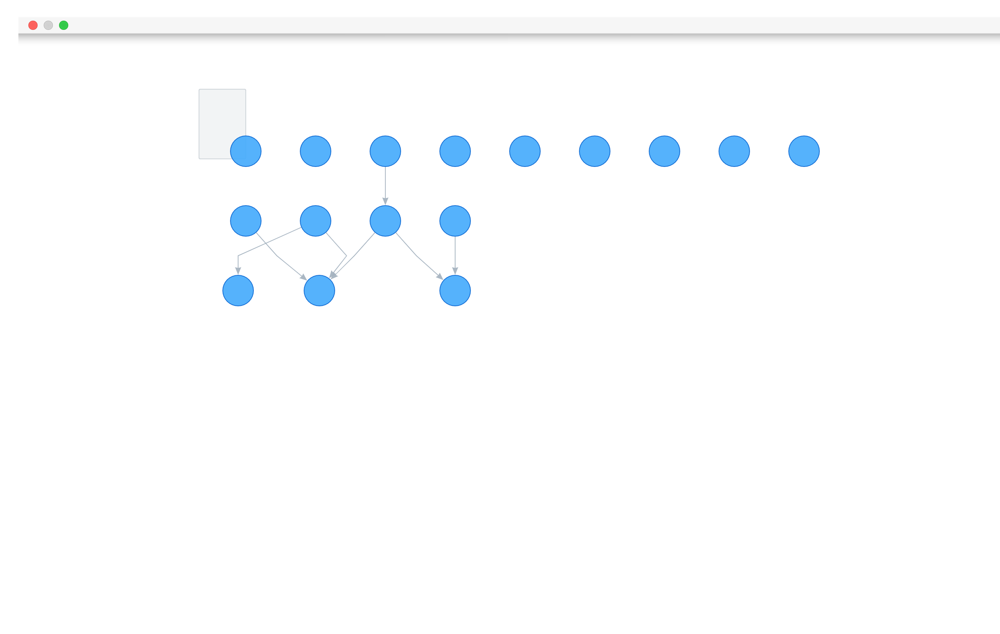
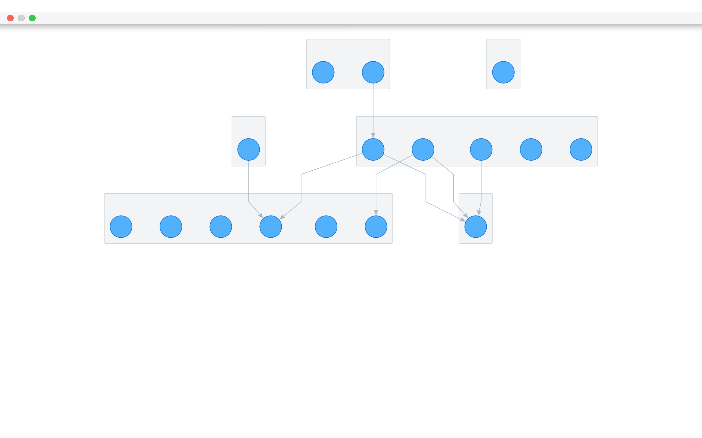

# g6v2-plugin-layout-dagre
> dagre layout plugin, based on g6 v2.

### 解决了什么问题?
- 支持组合点（即 groups）

`@antv/g6` 内置的 dagre 布局插件对 groups 的支持效果（[源码](https://codesandbox.io/s/static-x0eyo)）：

修改 dagre 布局插件后对 groups 的支持效果（[源码](./demo/compound.html)）：

### 缺点
dagre 中计算了组合点（group）的位置，在 g6 绘制 group shape 时，group 位置会被根据子节点重新计算。
